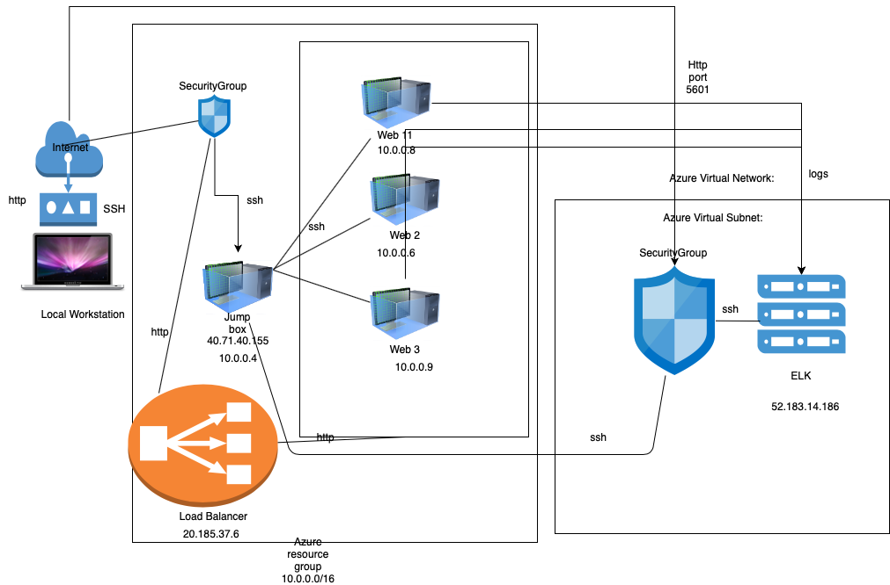
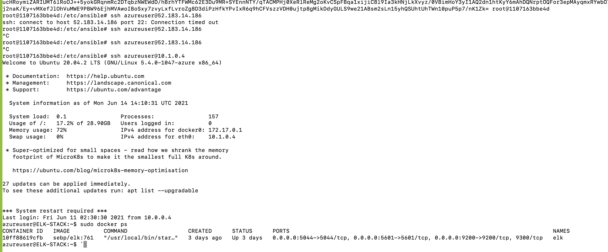

## Automated ELK Stack Deployment

The files in this repository were used to configure the network depicted below.



These files have been tested and used to generate a live ELK deployment on Azure. They can be used to either recreate the entire deployment pictured above. Alternatively, select portions of the YML_ file may be used to install only certain pieces of it, such as Filebeat.

```
---
- name: Config Web VM with Docker
  hosts: webservers
  become: true
  tasks:
  - name: docker.io
    apt:
      force_apt_get: yes
      update_cache: yes
      name: docker.io
      state: present

  - name: Install pip3
    apt:
      force_apt_get: yes
      name: python3-pip
      state: present

  - name: Install Docker python module
    pip:
      name: docker
      state: present

  - name: download and launch a docker web container
    docker_container:
      name: dvwa
      image: cyberxsecurity/dvwa
      state: started
      published_ports: 80:80

  - name: Enable docker service
    systemd:
      name: docker
      enabled: yes

```

This document contains the following details:
- Description of the Topologu
- Access Policies
- ELK Configuration
  - Beats in Use
  - Machines Being Monitored
- How to Use the Ansible Build


### Description of the Topology

The main purpose of this network is to expose a load-balanced and monitored instance of DVWA, the D*mn Vulnerable Web Application.

Load balancing ensures that the application will be highly available_, in addition to restricting _traffic to the network.
- _TODO: What aspect of security do load balancers protect? What is the advantage of a jump box?_ Load balancers are machines that will redirect the traffic to the most avaiulable Web server. If one web server has too much traffic, the load balancer will redirect us the the next Web server.
A jumbox allows the sysadmin to login via ssh on the web servers to troubleshoot them and build them with ansible. Ansible automates tasks like creating a web server.

Integrating an ELK server allows users to easily monitor the vulnerable VMs for changes to the _metics and system _files____.
- _TODO: What does Filebeat watch for?_ The files that have been requested and how often, the type of response from the web server and the type of traffic recorded
- _TODO: What does Metricbeat record?_ The usage of the CPU, memory and other measures of the Web server

The configuration details of each machine may be found below.
_Note: Use the [Markdown Table Generator](http://www.tablesgenerator.com/markdown_tables) to add/remove values from the table_.

| Name     | Function | IP Address | Operating System |
|----------|----------|------------|------------------|
| Jump Box | Gateway  | 10.0.0.4 and 40.71.40.155  | Linux            |
| Web11     |       Web server   |    10.0.0.8        |       Linux           |
| Web2     |    web server      |  10.0.0.6         |       Linux      |
| Web3     |    web server      |  10.0.0.9         | 
| ELK     |      Monitor traffic    |    10.1.0.4        |      linux            |

### Access Policies

The machines on the internal network are not exposed to the public Internet. 

Only the __jumpbox___ machine can accept connections from the Internet. Access to this machine is only allowed from the following IP addresses:
- _My public IP address

Machines within the network can only be accessed by SSH from the jumpbox.
- _TODO: Which machine did you allow to access your ELK VM? What was its IP address?_ The jumpbox only can access ELK, IP is 10.0.0.4

A summary of the access policies in place can be found in the table below.

| Name     | Publicly Accessible | Allowed IP Addresses |
|----------|---------------------|----------------------|
| Jump Box | Yes             | my public IP   |
| Web11     |      no  |    10.0.0.4       |
| Web2     |   no     |  10.0.0.4    |
| Web3     |    no     |  10.0.0.4         | 
| ELK     |     no  |    10.0.0.4         |


### Elk Configuration

Ansible was used to automate configuration of the ELK machine. No configuration was performed manually, which is advantageous because...
- _TODO: What is the main advantage of automating configuration with Ansible?_ Less human errors and deployment is faster and more scalable

The playbook implements the following tasks:
- _TODO: In 3-5 bullets, explain the steps of the ELK installation play. E.g., install Docker; download image; etc._
```

    # Use apt module
    -Install docker.io
      # Use apt module
    - Install pip3
      # Use pip module
    -  Install Docker python module

      # Use sysctl module
    -  Use more memory

      # Use docker_container module
    - download and launch a docker elk container

      # Use systemd module
    -  Enable service docker on boot
```


The following screenshot displays the result of running `docker ps` after successfully configuring the ELK instance.



### Target Machines & Beats
This ELK server is configured to monitor the following machines:
- 10.0.0.6
10.0.0.8
10.0.0.9

We have installed the following Beats on these machines:
-metricbeat and filebeat

These Beats allow us to collect the following information from each machine:
- _TODO: In 1-2 sentences, explain what kind of data each beat collects, and provide 1 example of what you expect to see. E.g., `Winlogbeat` collects Windows logs, which we use to track user logon events, etc._
Metricbeat collects system performance, how much CPU and memory is being used on the web servers
Filebeat collects information about which files are requested and how much traffic they receive, as well as the servers respons (failure, success or redirection)

### Using the Playbook
In order to use the playbook, you will need to have an Ansible control node already configured. Assuming you have such a control node provisioned: 

SSH into the control node and follow the steps below:
- Copy the elk playbook_ file to ansible_.
- Update the ____host_ file to include the Webserver and Elk IPs...
- Run the playbook, and navigate to _the Elk VM via SSH___ to check that the installation worked as expected.

_TODO: Answer the following questions to fill in the blanks:_
- _Which file is the playbook? Where do you copy it?_ ilstall-elk.yml
- _Which file do you update to make Ansible run the playbook on a specific machine? the host file where we put the ELK ip
How do I specify which machine to install the ELK server on versus which to install Filebeat on?_  By putting the elk ip in the host file
- _Which URL do you navigate to in order to check that the ELK server is running?
http://52.183.14.186:5601/app/kibana
